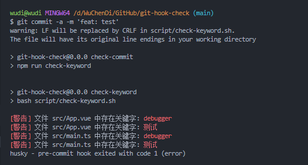
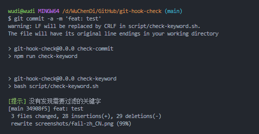

# 🚀 git-hook-check

简体中文 | [English](./README.md)

- 使用 git hook 对暂存区中的文件进行关键字拦截 [Link](./script/check-keyword.sh)
- 对配置目录文件进行关键字拦截 [Link](./script/file-check-keyword.sh)

## ✨ TODO

- [x] 🔨 设置需要过滤的关键字
- [x] 🔨 设置不需要检测的目录或文件路径
- [ ] 🔨 xxx

## ⚡ code

```sh
# 预先提交钩子，对暂存区中的文件列表进行关键字拦截
# 必要时将不需要的代码添加到 FILTER_WORDS 中

#!/bin/bash

# 设置需要过滤的关键字(支持中文)
FILTER_WORDS="debugger 测试"

# 设置不需要检测的目录或文件路径
IGNORE_PATHS=".git node_modules script src/App.vue README.md README-zh_CN.md"

# 获取所有已暂存的文件的文件名列表
FILES=$(git diff --name-only --cached)

# 定义是否发现错误标志
has_error=false

# 遍历所有文件
for FILE in $FILES; do
  # 判断文件是否在不需要检测的目录或文件路径中
  IGNORE=false
  for IGNORE_PATH in $IGNORE_PATHS; do
    if [[ $FILE == *"$IGNORE_PATH"* ]]; then
      IGNORE=true
      break
    fi
  done
  if $IGNORE; then
    continue
  fi

  # 判断文件中是否存在需要过滤的关键字
  for FILTER_WORD in $FILTER_WORDS; do
    if grep -Eiq "$FILTER_WORD" "$FILE"; then
      echo -e "\033[31m[警告]\033[0m 文件 $FILE 中存在关键字: \033[31m$FILTER_WORD\033[0m"
      has_error=true
    fi
  done
done

# 如果发现错误，退出
if $has_error; then
  exit 1
fi

echo -e "\033[32m[提示]\033[0m 没有发现需要过滤的关键字"
exit 0

```

## 🔍 执行效果

### fail



### succeed



## 🎈 License

[](https://github.com/WuChenDi/git-hook-check/blob/master/LICENSE)
