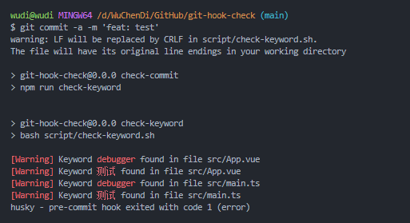
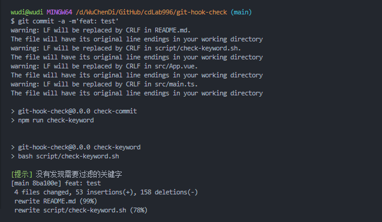

# 🚀 git-hook-check

English | [简体中文](./README-zh_CN.md)

Use git hook to block keywords for files in the staging area. [Link](./script/check-keyword.sh)

## ✨ TODO

- [x] 🔨 Set the keywords to be filtered
- [x] 🔨 Set the path to a directory or file that does not need to be detected
- [ ] 🔨 xxx

## ⚡ code

```sh
# Pre commit hooks to keyword intercept the list of files in the staging area
# Add unwanted code to FILTER_WORDS if necessary

#!/bin/bash

# Set the filter keywords (support Chinese)
FILTER_WORDS="测试 debugger"

# Set the directories or file paths that don't need to be checked
IGNORE_PATHS=".git node_modules script src/App.vue"

# Get the list of files in the cache area
FILES=$(git diff --name-only --cached)

# Loop through the file list
for FILE in $FILES; do
  # Check if the file is in the directories or file paths that don't need to be checked
  IGNORE=false
  for IGNORE_PATH in $IGNORE_PATHS; do
    if [[ $FILE == *"$IGNORE_PATH"* ]]; then
      IGNORE=true
      break
    fi
  done
  if $IGNORE; then
    continue
  fi

  # Check if the file contains the filter keywords
  for FILTER_WORD in $FILTER_WORDS; do
    if grep -Eiq "$FILTER_WORD" "$FILE"; then
      echo -e "\033[31m[Warning]\033[0m Keyword \033[31m$FILTER_WORD\033[0m found in file $FILE"
      exit 1
    fi
  done
done

echo -e "\033[32m[Info]\033[0m No filtered keywords found"
exit 0

```

## 🔍 Execution Effect

### fail



### succeed



## 🎈 License

[](https://github.com/HJFront/gotabit-sdk-vue/blob/master/LICENSE)
